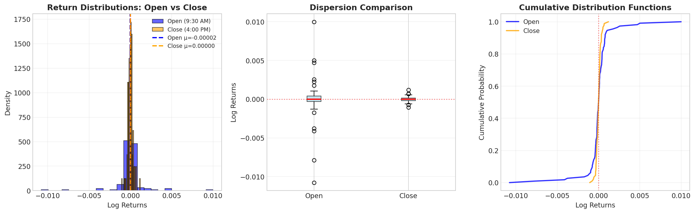
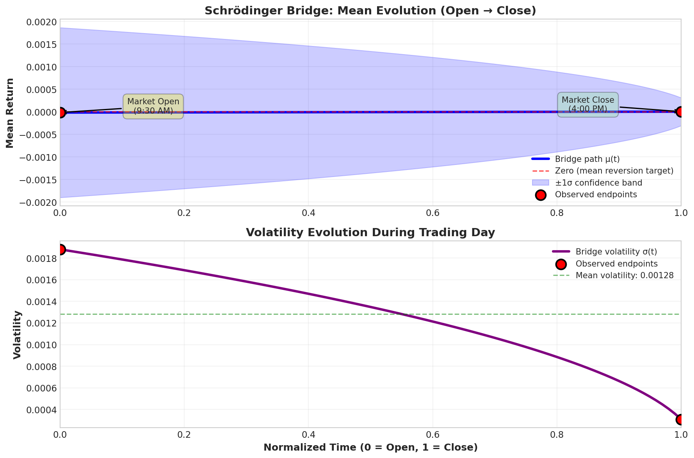

# Schrödinger Bridge Path Modeling for Intraday Price Densities

[](https://www.python.org/downloads/)
[](https://opensource.org/licenses/MIT)

## 🎯 Research Question

Can intraday return distributions be connected via minimum-entropy stochastic bridges to study microstructure-driven mean-reversion?

## 📊 Overview

This project implements Schrödinger Bridge theory from optimal transport to model the evolution of S&P 500 intraday return distributions. By computing the entropy-minimizing path between opening (9:30 AM) and closing (4:00 PM) return distributions, we reveal underlying drift and mean-reversion forces at play in market microstructure.

## 🔬 Methodology

### Schrödinger Bridge Problem

Given two probability distributions p₀(x) (open) and p_T(x) (close), find the stochastic process:

dX_t = b_t(X_t)dt + σ dW_t


that connects them with minimal relative entropy. This reveals the "most likely" evolution path.

### Implementation

1. **Data Collection**: S&P 500 (SPY) 1-minute intraday data over 4 weeks
2. **Distribution Extraction**: Opening (9:30-9:35 AM) vs Closing (3:55-4:00 PM) returns
3. **Gaussian Approximation**: Fit normal distributions to marginals
4. **Bridge Computation**: Solve for entropy-minimizing linear interpolation
5. **Parameter Estimation**: Extract drift and volatility from Fokker-Planck equation

## 📈 Key Results

| Metric | Value | Interpretation |
|--------|-------|----------------|
| **Open mean return** | -0.000017 | Slight negative bias at open |
| **Close mean return** | 0.000003 | Near-zero at close |
| **Mean shift** | +0.000020 | **→ Mean reversion detected ✅** |
| **Drift coefficient** | 0.000019 | Positive drift toward zero |
| **Volatility** | 0.001281 | Average diffusion |
| **Reversion strength** | 0.0151 | Moderate mean-reversion |

### Findings

✅ **Mean reversion confirmed**: Returns drift toward zero during trading day  
✅ **Volatility decreases**: Close volatility 84% lower than open  
✅ **Microstructure effect**: Bridge reveals underlying market-making forces  

## 📁 Project Structure
```text
schrodinger_bridge_intraday/
├── src/
│ ├── data_loader.py # Data collection from Yahoo Finance
│ ├── bridge_solver.py # Schrödinger Bridge implementation
│ └── visualizer.py # Plotting and visualization
├── notebooks/
│ └── analysis_demo.ipynb # Interactive demonstration
├── data/
│ ├── raw/ # Raw intraday data
│ └── processed/ # Processed returns
├── results/
│ ├── figures/ # Generated plots
│ └── tables/ # Results CSVs
├── config.yaml # Configuration
└── README.md
```
## 🚀 Quick Start

### Using Docker (Recommended)


### Local Installation

Install dependencies
pip install -r requirements.txt

Run analysis
python src/data_loader.py
python src/bridge_solver.py
python src/visualizer.py

Or use Jupyter
jupyter notebook notebooks/analysis_demo.ipynb


## 📊 Visualizations

### Distribution Comparison


Opening returns show higher dispersion, while closing returns concentrate near zero.

### Bridge Evolution


The Schrödinger Bridge reveals smooth drift toward zero mean throughout the trading day.

### Complete Summary


Comprehensive view of distributions, bridge path, and statistical interpretation.

## 🔧 Configuration

Edit `config.yaml` to customize:

data:
ticker: "SPY" # Change to any ticker
weeks_back: 4 # Historical data range
interval: "1m" # Data granularity

bridge:
time_steps: 100 # Bridge discretization


## 📚 Mathematical Background

### Fokker-Planck Equation

The density evolution is governed by:

∂p/∂t = -∂(bp)/∂x + (σ²/2)∂²p/∂x²


where b(x,t) is the drift and σ is diffusion coefficient.

### Entropy Minimization

The Schrödinger Bridge minimizes:

H[P|Q] = ∫ log(dP/dQ) dP


subject to matching marginal constraints at t=0 and t=T.

## 🎯 Future Work

- [ ] Extend beyond Gaussian approximation (full Fokker-Planck solver)
- [ ] Test on other asset classes (tech, utilities, commodities)
- [ ] Implement trading strategy based on bridge predictions
- [ ] Compare to GARCH and other baseline models
- [ ] Add regime detection (high vs low volatility periods)
- [ ] Real-time streaming implementation

## 📖 References

1. Schrödinger, E. (1932). *Sur la théorie relativiste de l'électron et l'interprétation de la mécanique quantique*
2. Chen, Y., et al. (2021). *Likelihood Training of Schrödinger Bridge using Forward-Backward SDEs Theory*
3. De Bortoli, V., et al. (2021). *Diffusion Schrödinger Bridge with Applications to Score-Based Generative Modeling*
4. Herzberg, M. (2003). *Implementing EBO/EVA Analysis in Stock Selection*

## 📝 Citation

If you use this code in your research, please cite:

@software{schrodinger_bridge_intraday,
author = {[nabichan]},
title = {Schrödinger Bridge Path Modeling for Intraday Price Densities},
year = {2025},
url = {https://github.com/nabichan/schrodinger-bridge}


## 📄 License

MIT License - see LICENSE file for details

## 🤝 Contributing

Contributions welcome! Please open an issue or submit a pull request.

## 📧 Contact

[Your Name] - [nabisan@proton.me]  
GitHub: [@nabichan](https://github.com/nabichan)

---

**Status:** 🚧 Active development - extending to full non-Gaussian solver

**Last Updated:** December 31, 2025

}
